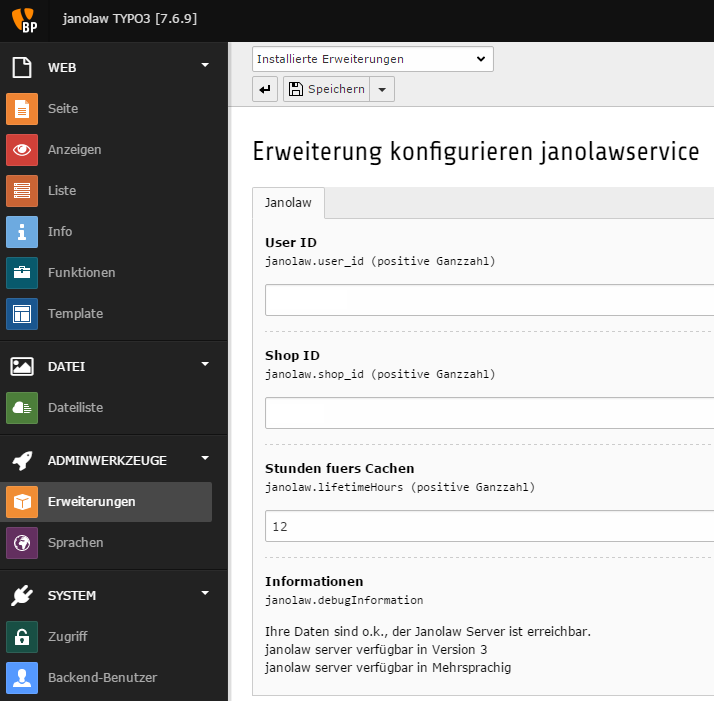
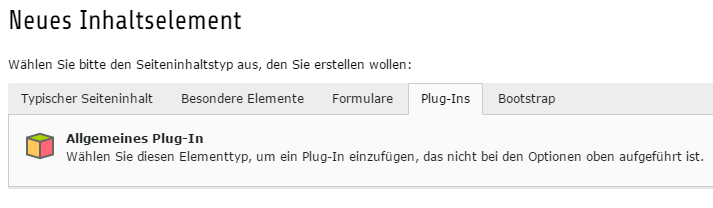
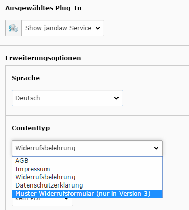
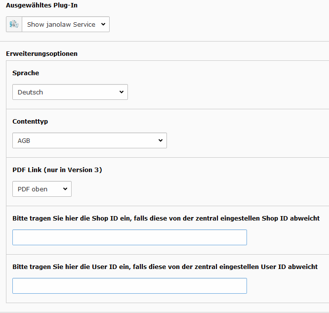
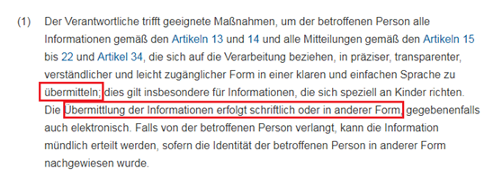

.. include:: ../Includes.txt

.. _start:

======================
Plugin Janolaw Service
======================
.. only:: html

**Einbindungsanleitung TYPO3**

**Versionshinweis**

Bitte prüfen Sie ob Ihnen die Rechtstexte in der **janolaw Version 3** zur Verfügung stehen. Dies
ist der Fall, wenn die Texte im Jahr 2016 erstellt worden sind. Sollten Sie Zweifel haben, dann
prüfen Sie nach dem Login in Ihrem persönlichen Bereich `My janolaw <https://www.janolaw.de/login.html>`__
in der Übersicht das Datum der letzten Erstellung bzw. ob Sie den Menüpunkt "Stammdaten ändern"
haben. Mit einer einmaligen Neubeantwortung des gesamten Fragenkatalogs erhalten Sie automatisch die
aktuellste Version.

**WICHTIG**

Bitte achten Sie auch darauf, welchen Service Sie erworben haben, ob es sich hierbei um die deutsche
bzw. mehrsprachige Version handelt und ob darin nur das Impressum und die Datenschutzerklärung
(`Webseite <http://www.janolaw.de/internetrecht/firmen-webseiten/datenschutzerklaerung_impressum.html>`__)
enthalten sind bzw. auch die AGB, Widerrufsbelehrung und das Muster-Widerrufsformular
(`Internetshop <http://www.janolaw.de/internetrecht/internetshop/abmahnschutz-internetshop.html>`__)

**Version Historie der TYPO3 Extension**

2.0 Support von TYPO3 10 und TYPO3 11, für Updates bitte die Datenbankstruktur aktualisieren!

1.2. Support von TYPO3 7, TYPO3 und TYPO3 9

1.0 Support von TYPO3 7 und TYPO3 8, Multisitefunktion

0.1 Support von TYPO3 7

**1. Installation**

Installieren Sie die Extension entweder über das Admintool Erweiterungen oder falls Sie composer nutzen mit

composer require janolaw/janolawservice

**Update:** Wenn Sie die vorhandene Extension von der Version 1.x auf die Version 2.x aktualisieren,
dann führen Sie nach dem Update bitte eine Aktualisierung der Datenbankstruktur durch (unter
Verwaltungswerkzeuge -> Wartung -> Analyse Database Structure).

**2. Konfiguration**

Nach der Installation der janolaw Extension können Sie die zentralen Einstellungen vornehmen in den
Verwaltungswerkzeugen unter Einstellungen -> Extension Configuration. Hier können Sie die zentralen
Einstelllungen für die User ID und Shop ID vornehmen und die Cache Laufzeit anpassen.

Tragen Sie in die Maske Ihre **User-ID (Kundennummer)** und **Shop-ID**
ein, die Sie von janolaw erhalten haben. Sie finden diese in Ihrem
persönlichen Bereich `My janolaw <https://www.janolaw.de/login.html>`__
bzw. in der E-Mail, die Sie nach der Erstellung der Dokumente erhalten
haben. Bestätigen Sie die Angaben mit dem Speichern Button.

|image1|

Falls Sie auf die zentrale Konfiguration keinen Zugriff haben, können Sie die User ID und Shop ID
auch beim Anlegen des Inhaltes pflegen.

**3. Webseiten**

Rufen Sie den Menüpunkt Seite auf und ergänzen dort die bestehenden
Seiten um die Rechtstexte von janolaw bzw. legen falls nötig neue Seiten
an.

|image2|

Um die Texte automatisiert in den Content der Webseiten einzubinden
rufen Sie die spezifische Seite aus und wählen in den Inhaltselementen
„\ *Plug-Ins*\ “ aus.

|image3|

Nach dem Öffnen der Content Seite wählen Sie unter dem Schiebereiter „\ *Allgemein*\ “ den Menüpunkt
„\ *Plug-In*\ “ aus und rufen dort das janolaw Plugin auf.
Hier können Sie nun die bzw. das spezifische Dokument von janolaw der jeweiligen Webseite zuordnen
bzw. falls vorhanden auch die jeweilige Sprachversion des Dokuments zuordnen.

In der janolaw Version 3 (vgl. S. 1 Versionshinweis der Einbindungsanleitung) ist es möglich über
die Auswahl „\ *PDF Link*\ “ im Frontend der Webseiten die PDF-Version des jeweiligen Dokuments in
Form eines Downloadlink unterhalb oder oberhalb der Rechtstexte bzw. nur den Link anzeigen zu lassen.

Bestätigen Sie bitte die Eingabe mit dem „\ *Speichern Button*\ “!

|image5|

**4. Konfiguration**

Alternativ können Sie Texte auch über TypoScript in Ihr Template
integrieren.

TypoScript Beispiel

    | lib.pdflink = USER
    | lib.pdflink {
    | userFunc = TYPO3\\CMS\\Extbase\\Core\\Bootstrap->run
    | extensionName = Janolawservice
    | pluginName = Showjanolawservice
    | vendorName = Janolaw
    | settings.janolawservice.language=de
    | settings.janolawservice.type=terms
    | settings.janolawservice.pdflink=only\_pdf\_link
    | settings.janolawservice.userid=123
    | settings.janolawservice.shopid=123
    | }

Mögliche Werte für settings.janolowservice:

-  language: en\|gb\|fr

-  type:
   terms\|legaldetails\|revocation\|datasecurity\|model-withdrawal-form

-  pdflink: no\_pdf\|pdf\_top\|pdf\_bottom\|only\_pdf\_link (no\_pdf ist
   default)

-  userid: enthält die UserID falls dies abweicht von der Zentralen Einstellung

-  shopid: enthält die UserID falls dies abweicht von der Zentralen Einstellung

**5. Multisite**

Wenn Sie in einer TYPO3 Installation mehrere Seiten verwenden, die unterschiedliche Shop/UserIds
bei janolaw haben, so können Sie diese über die Inhaltselemente oder über die TypoScript
Konfiguration aussteuern.

**WICHTIG**

Bitte nehmen Sie eventuelle Änderungen an den janolaw Dokumenten
ausschließlich auf www.janolaw.de vor. Dazu müssen Sie sich in den
Bereich `My janolaw <https://www.janolaw.de/login.html>`__ einloggen und
dort die Dokumente ggf. neu erstellen.

**PRÜFUNG**

Bitte prüfen Sie ob die Rechtstexte nach Aktivierung des Plugins auf den Webseiten erscheinen.
Wenn die Einbindung korrekt erfolgt ist werden die von Ihnen erstellten Dokumente über die
Schnittstelle synchronisiert, dort gespeichert und automatisch bei Änderungen auf den jeweiligen
Seiten aktualisiert.

**Wenn Sie einen Online-Shop betreiben, dann berücksichtigen Sie bitte die folgenden Punkte!**

**E-Mail Auftragsbestätigung rechtssicher gestalten**

Die folgenden Dokumente müssen per E-Mail Auftragsbestätigung oder spätestens mit dem Warenversand
dem Kunden zugeschickt werden.

-  AGB
-  Widerrufsbelehrung
-  Muster-Widerrufsformular
-  Datenschutzerklärung ab Mai 2018

Um eine Abmahnung zu vermeiden empfehlen wir auch den Versand der Datenschutzerklärung in der E-Mail
Auftragsbestätigung aufgrund des für die Shop-Datenschutzerklärungen relevanten Art. 12 der
Datenschutzgrundverordnung (DSGVO) `https://dsgvo-gesetz.de/art-12-dsgvo/ <https://dsgvo-gesetz.de/art-12-dsgvo/>`__
Hier wird explizit von der Übermittlung an die betroffene Person gesprochen und nicht von der
allgemeinen Öffentlichkeit.

|image6|

**WICHTIG**

- Bitte prüfen Sie im Rahmen eines Testkaufs auch ob Sie die Dokumente in der E-Mail Auftragsbestätigung korrekt eingebunden haben bzw. ob die oben aufgeführten Dokumente per Schnittstelle automatisch eingebunden wurden.
-  Wenn die Funktionalität nur teilweise gegeben ist, dann müssen Sie die restlichen Texte händisch in der E-Mail Auftragsbestätigung hinterlegen und diese bei Änderungen manuell aktualisieren.
-  Der Versand kann dann als E-Mail Anhang erfolgen indem Sie die Rechtstexte jeweils als PDF Dokument umwandeln.
-  Alternativ können Sie den Rechtstext auch in die E-Mail Auftragsbestätigung unterhalb der  Kaufbestätigung / Signatur herein kopieren. Bitte achten Sie bei dieser Variante darauf, dass Sie nicht die von der Schnittstelle automatisch eingespielten Rechtstexte überschreiben, da bei der nächsten Synchronisation die von Ihnen händisch ergänzten Texte überschrieben werden.
- Ihre Rechtstexte im Word Format finden Sie nach dem Login in Ihrem persönlichen Bereich `My janolaw <https://www.janolaw.de/login.html>`__ über den Klick auf Übersicht aufrufen.

**HINWEIS**
Eine reine Verlinkung auf die Rechtstexte in der E-Mail Auftragsbestätigung ist nicht ausreichend!

**Textuelle Änderungen**

Bitte nehmen Sie eventuelle Änderungen an den janolaw Dokumenten ausschließlich auf www.janolaw.de vor. Dazu müssen Sie sich in den Bereich `My janolaw <https://www.janolaw.de/login.html>`__ einloggen
und dort die Dokumente ggf. neu erstellen.

**Muster-Widerrufsformular**

Das Muster-Widerrufsformular muss per E-Mail oder spätestens mit dem Warenversand zugeschickt werden. Zusätzlich muss das Widerrufsformular als weiterer Menüpunkt / Link in Ihren Internetshop neben den schon bestehenden Links für AGB, Impressum, Datenschutzerklärung, Widerrufsbelehrung und dem aktiven
Link zur Online Streitbeilegungsplattform (OS-Plattform) angelegt werden.

**Online Streitschlichtungsvorlage (OS-Plattform)**

Nach der europäischen ODR-Verordnung (Verordnung über die außergerichtliche Online-Beilegung verbraucherrechtlicher Streitigkeiten) müssen Unternehmer, die an Verbraucher verkaufen seit dem
9. Januar 2016 auf ihren Webshops einen **aktiven Link** auf die OS-Plattform (`https://ec.europa.eu/consumers/odr/ <https://ec.europa.eu/consumers/odr/>`__ ) setzen **und ihre E-Mail Adresse** angeben.

**WICHTIG:**

Sie sollten den Link zur Plattform weder unter das Impressum noch in die AGB einfügen, da er dort als "versteckt" gelten könnte.

Hier unser Textvorschlag:

Die EU-Kommission stellt eine Plattform für außergerichtliche Streitschlichtung bereit. Verbrauchern
gibt dies die Möglichkeit, Streitigkeiten im Zusammenhang mit ihrer Online-Bestellung zunächst
außergerichtlich zu klären. Die Streitbeilegungs-Plattform finden Sie hier:
`https://ec.europa.eu/consumers/odr/ <https://ec.europa.eu/consumers/odr/>`__

Unsere E-Mail für Verbraucherbeschwerden lautet: ......@......

**Probleme bei der Einbindung**

Bitte prüfen Sie, ob Sie folgende Fehlerquellen ausschließen können:

-  Bitte achten Sie darauf, welchen Service Sie erworben haben, ob darin nur das Impressum und die Datenschutzerklärung (Webseiten) enthalten sind bzw. alle Dokumente d.h. auch AGB, Widerrufsbelehrung und Muster-Widerrufsformular (Online-Shops).
-  User-ID / Kundennummer bzw. SHOP-ID / Rechtstexte-ID korrekt eingetragen (ohne Leerzeichen) und nicht vertauscht?
-  PHP muss Zugriff auf andere URLs nehmen können, um dort Dateien runterladen zu können.
-  In der php.ini des Servers muss allow_url_fopen aktiviert sein.

.. |image2| image:: ../Images/image3.png

